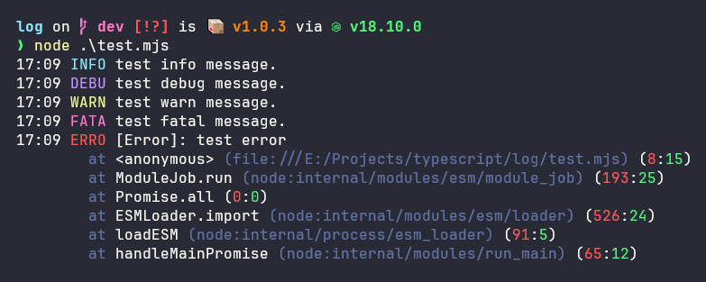

# log

simple logger, lol

## Installation

The package is available under `@avolgha/log` in the NPM registry.  
Just use one of these commands to install the package:

```shell
# if you use npm
$ npm install @avolgha/log

# if you use yarn
$ yarn add @avolgha/log

# if you use pnpm (like me)
$ pnpm install @avolgha/log
```

## Usage

```typescript
import logger from "@avolgha/log";

logger.info("test info message.");
logger.debug("test debug message.");
logger.warn("test warn message.");
logger.error("test error message.");
logger.fatal("test fatal message.");
```

> If you execute this code on your computer,
> it will result in the following:
> 
